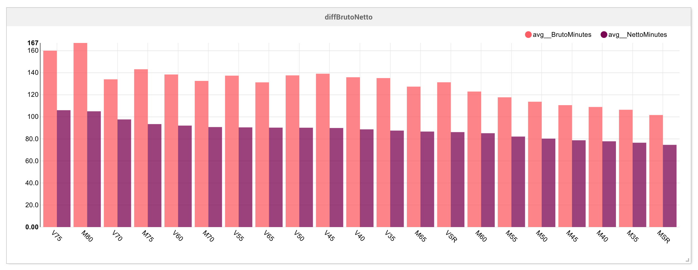

#Zevenheuvelenloop Uitslag Scraper
Automated scraper build with <a href="https://scrapy.org/" alt="Reddit">Scrapy</a> that scrapes data from the running event Zevenheuvelenloop. The data gets scraped from <a href="http://evenementen.uitslagen.nl/2016/zevenheuvelenloop/" alt="Karma Decay">http://evenementen.uitslagen.nl/</a>.

<br>The scraper process works as follows: <br>
<ol>
<li> The allowed domain gets set to <a href="http://evenementen.uitslagen.nl">evenementen.uitslagen.nl</a> </li>
<li> The max_id value should be changed to the maximum amount of pages that you want to have scraped.</li>
<li> An example of the maximum url can be <a href="http://evenementen.uitslagen.nl/2016/zevenheuvelenloop/uitslag01233.html">~uitslag01233.html"</li>
<li> The scraper will scrape the set amount of pages and add  those to the csv file until done. </li>

</ol>
####Example with Airbnb's Superset


###Why???
After competing in the event myself i wanted to have some answers based on the data that was given. Things like what was the average finish time of a certain category, how much people did i overtake overal, in my category etc etc.

###How to use
You can use the scraper by using the command
```bash
scrapy runspider ZevenHeuvelSpider_spider.py -o zevenheuvel.csv
```
After completion, you can open the zevenheuvel.csv for inspection.

###Resources Used
- <a href="http://evenementen.uitslagen.nl/2016/zevenheuvelenloop/" alt="evenementen.uitslagen.nl">kdapi</a>
- <a href="https://scrapy.org/" alt="scrapy">Scrapy</a>
- <a href="https://github.com/airbnb/superset" alt="SuperSet">Airbnb's SuperSet</a>
